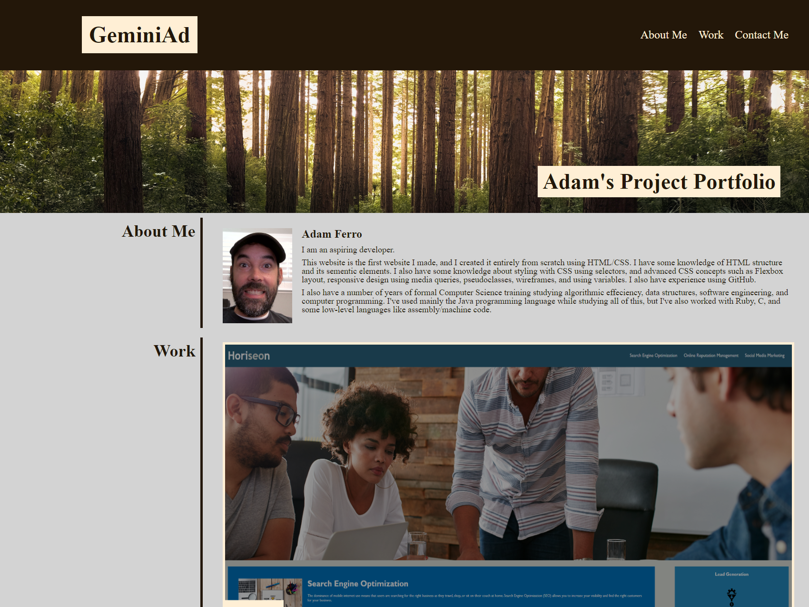
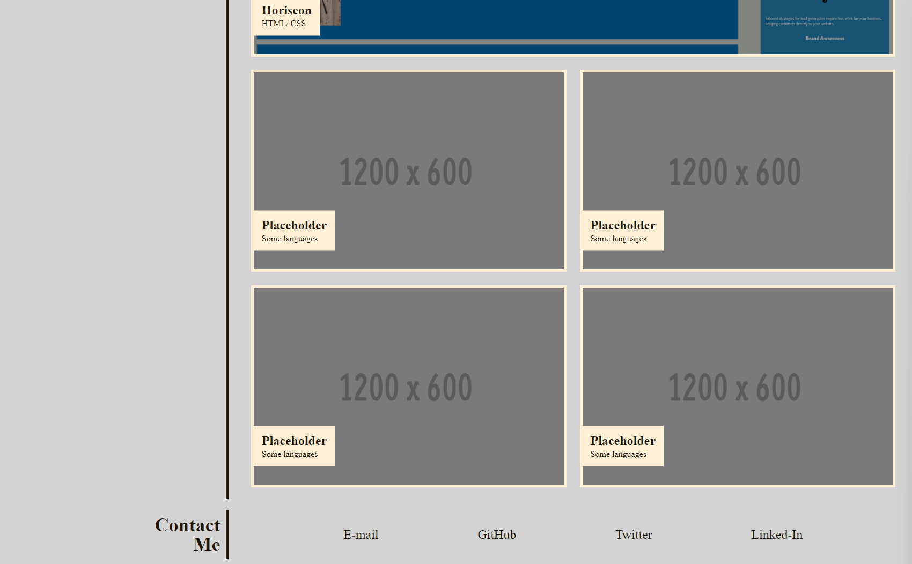

<h1 align="center">
  <a href="https://geminiad.github.io/project-portfolio" target="_blank">Project Portfolio</a>
  <br>
</h1>

<p align="center">
  <a href="#description">Description</a> •
  <a href="#key-features">Key Features</a> •
  <a href="#usage">Usage</a> •
  <a href="#credits">Credits</a>
</p>




## Description 
As an aspiring developer, I need to have a portfolio to showcase my work. Having several deployed projects is a minimum requirement to receive an initial interview at many companies. My project portfolio must meet the following criteria:

### User Story
```
AS AN employer
I WANT to view a potential employee's deployed portfolio of work samples
SO THAT I can review samples of their work and assess whether they're a good candidate for an open position
```

### Acceptance Criteria
```
GIVEN I need to sample a potential employee's previous work
WHEN I load their portfolio
THEN I am presented with the developer's name, a recent photo, and links to sections about them, their work, and how to contact them
WHEN I click one of the links in the navigation
THEN the UI scrolls to the corresponding section
WHEN I click on the link to the section about their work
THEN the UI scrolls to a section with titled images of the developer's applications
WHEN I am presented with the developer's first application
THEN that application's image should be larger in size than the others
WHEN I click on the images of the applications
THEN I am taken to that deployed application
WHEN I resize the page or view the site on various screens and devices
THEN I am presented with a responsive layout that adapts to my viewport
```

## Key Features
This website was created entirely by me using HTML/CSS.

There's a navigation bar at the top with links to each of the three sections: the about me section, the section showcasing my work, and the contact 
me section. The about me section has a recent picture of me, my name, and a short description of me, including my skills. The work section showcases my work: I have my most recent project displayed larger than the other projects on the top row. The other projects are displayed below the most recent project, with two projects per row. Whenever you hover over an image of my project it brightens up the image as if you are selecting it. Each project image, when clicked, takes you to the deployed application - or, in the case of placeholder projects, just takes you to a placeholder image. The contact me section has some links to contact me.

This website also boasts a responsive design. On smaller resolutions - indicative of viewing this site on a tablet or smaller - I reduced some of the text and image sizes so the site doesn't look broken. It should look good when viewed on a desktop, laptop, tablet, or smart phone.

## Usage 
Navigate to:
<a href="https://geminiad.github.io/project-portfolio" target="_blank">https://geminiad.github.io/project-portfolio</a>
This project portfolio looks beautiful on desktops and tablets!
Its... functional on smartphones.

## Credits
All code contained in style.css and index.html
© 2022 Adam Ferro