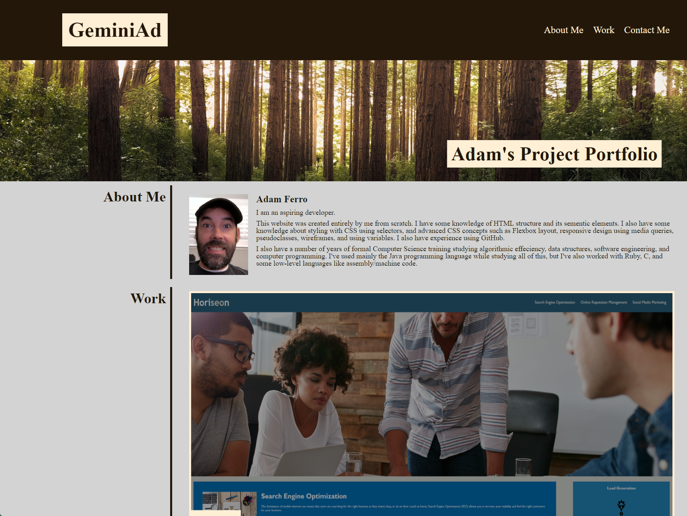
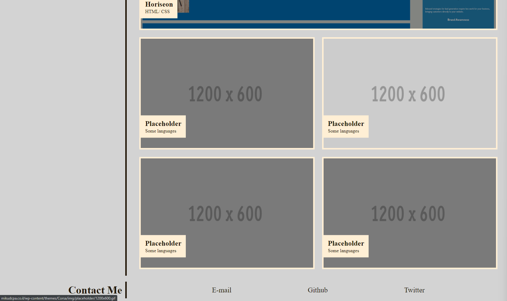

<h1 align="center">
  Project Portfolio
  <br>
</h1>

<p align="center">
  <a href="#description">Description</a> •
  <a href="#key-features">Key Features</a> •
  <a href="#usage">Usage</a>
</p>




## Description 
As an aspiring developer, I need to have a portfolio to showcase my work. Having several deployed projects is a minimum requirement to receive an initial interview at many companies. My project portfolio must meet the following criteria:

### User Story
```
AS AN employer
I WANT to view a potential employee's deployed portfolio of work samples
SO THAT I can review samples of their work and assess whether they're a good candidate for an open position
```

### Acceptance Criteria
```
GIVEN I need to sample a potential employee's previous work
WHEN I load their portfolio
THEN I am presented with the developer's name, a recent photo, and links to sections about them, their work, and how to contact them
WHEN I click one of the links in the navigation
THEN the UI scrolls to the corresponding section
WHEN I click on the link to the section about their work
THEN the UI scrolls to a section with titled images of the developer's applications
WHEN I am presented with the developer's first application
THEN that application's image should be larger in size than the others
WHEN I click on the images of the applications
THEN I am taken to that deployed application
WHEN I resize the page or view the site on various screens and devices
THEN I am presented with a responsive layout that adapts to my viewport
```

This site satisfies that criteria in an ascethically pleasing design, and was created by me from scratch.

## Key Features

### Responsive Design
The layout of the website changes based on the screen width.

## Usage 
